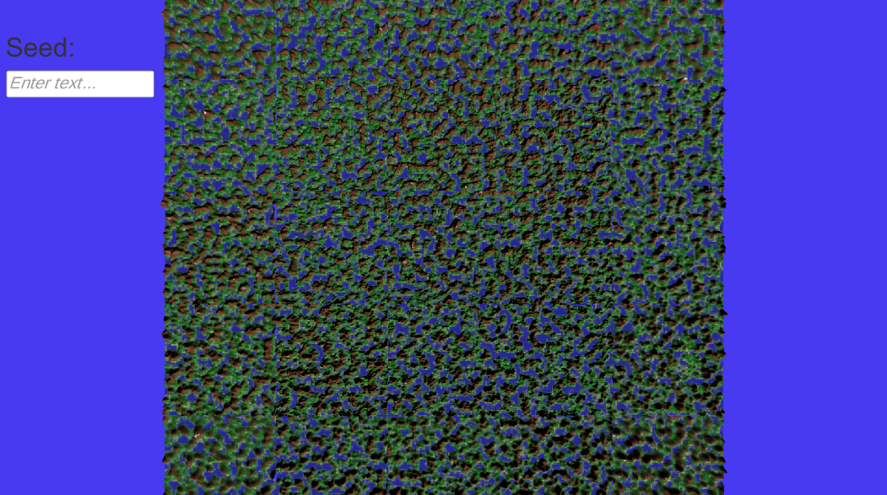

# 3D Random Terrain Generation

This project demonstrates a 3D random terrain generation system using the Unity engine. It creates unique, procedurally generated terrains, providing an immersive and dynamic environment each time it runs.



## Try It Out

You can try the project [here](https://hk-studio.itch.io/procedural-terrain-generation).

## Features

- Procedural generation of 3D terrains.
- Infinite terrain variations depending on seed.
- Real-time generation and rendering.

## How to Run

1. Clone the repository:
   ```sh
   git clone https://github.com/yourusername/3d-terrain-generation.git
   cd 3d-terrain-generation
2. Open the project in Unity:
   ```sh
   - Launch the Unity Hub.
   - Add the project to your Unity Hub.
   - Open the project in the Unity Editor.
3. Play the scene:
   ```sh
   - In the Unity Editor, open the main scene.
   - Click the "Play" button to start the terrain generation.
Or try the executable from the website

## Contribution

Contributions are welcome! If you have suggestions or improvements, feel free to open an issue or submit a pull request.
